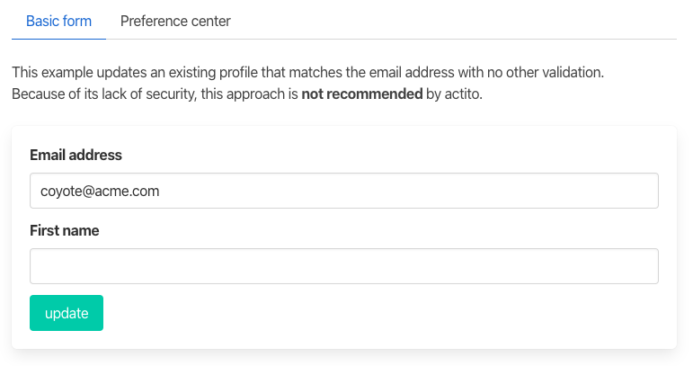

# Integrating a website with actito

_An integration framework illustration_

| :warning: **WARNING**: this is a preliminary version! |
| ----------------------------------------------------- |


## Use cases




## Back end - using the integration framework

The files in the "/api" folder illustrate the use of the actito integration framework to implement the use cases above.

The credentials for the actito access are expected to be in an environment variable named ACTITO_CONTEXT. It should be a json string with the following structure:

```
{
  "environment": "prod" or "test",
  "license": <YOUR ACTITO LICENSE NAME>,
  "credentials":"<YOUR ACTITO LICENSE NAME>/<YOUR WEBSERVICE USERNAME>:<YOUR PASSWORD>"
  }
```

We use zeit.co's [serverless functions](https://zeit.co/docs/v2/serverless-functions/introduction?query=serverless#) for these illustrations.

- **Basic form**

  - `enrich-profile.ts` updates the profile in actito

    ```typescript
    export default async function enrichProfile(req: NowRequest, res: NowResponse): Promise<void> {
      type ActitoResponse = { profileId: number };

      type Body = {
        entity: string;
        table: string;
        emailAddress: string;
        firstName: string;
      };

      const context: ActitoContext = JSON.parse(process.env.ACTITO_CONTEXT || "{}");

      try {
        const body: Body = req.body;
        const { emailAddress, firstName } = body;
        const actitoPath = `v4/entity/${body.entity}/table/${body.table}/profile/emailAddress=${emailAddress}`;
        const { profileId } = await actitoApi<ActitoResponse>(context, "PUT", actitoPath, {
          attributes: objectToProperties({ emailAddress, firstName })
        });
        res.send({ enrichedProfileId: profileId });
      } catch (err) {
        res.status(400).send(err);
      }
    }
    ```

- **Preference center**

  - `authenticate-profile.ts` authenticates the profile based on the fields provided. It also fetches values for prefill.
  - `update-profile.ts` updates the profile returned by the authentication.

    ```typescript
    export default async function updateProfile(req: NowRequest, res: NowResponse): Promise<void> {
      type Body = {
        entity: string;
        table: string;
        emailAddress: string;
        customerId: number;
        firstName: string;
      };

      type ActitoProfile = {
        attributes: ActitoProperty[];
      };

      type Profile = {
        profileId: number;
        firstName: string;
        emailAddress: string;
        CustomerID: number;
      };

      type ActitoResponse = { profileId: number };

      const context: ActitoContext = JSON.parse(process.env.ACTITO_CONTEXT || "{}");
      try {
        const body: Body = req.body;
        const fetchPath = `v4/entity/${body.entity}/table/${body.table}/profile/emailAddress=${body.emailAddress}`;
        const response = await actitoApi<ActitoProfile>(context, "GET", fetchPath);
        const profile = propertiesToObject(response.attributes) as Profile;

        const updatePath = `v4/entity/${body.entity}/table/${body.table}/profile/${profile.profileId}`;
        const { profileId } = await actitoApi<ActitoResponse>(context, "PUT", updatePath, {
          attributes: objectToProperties({ firstName: body.firstName })
        });
        res.send({ updatedProfileId: profileId });
      } catch (err) {
        res.status(400).send(err);
      }
    }
    ```

Please see the jsdocs in the individual files for more information.

## Front end

We use [Create React App](https://create-react-app.dev/) to build the website for this illustration.

Major packages used in this illustration are :

- [Bulma](https://bulma.io/) for styling
- [Reacth Hook Form](https://react-hook-form.com/) for the form handling, with [yup](https://github.com/jquense/yup) for the form validation.
